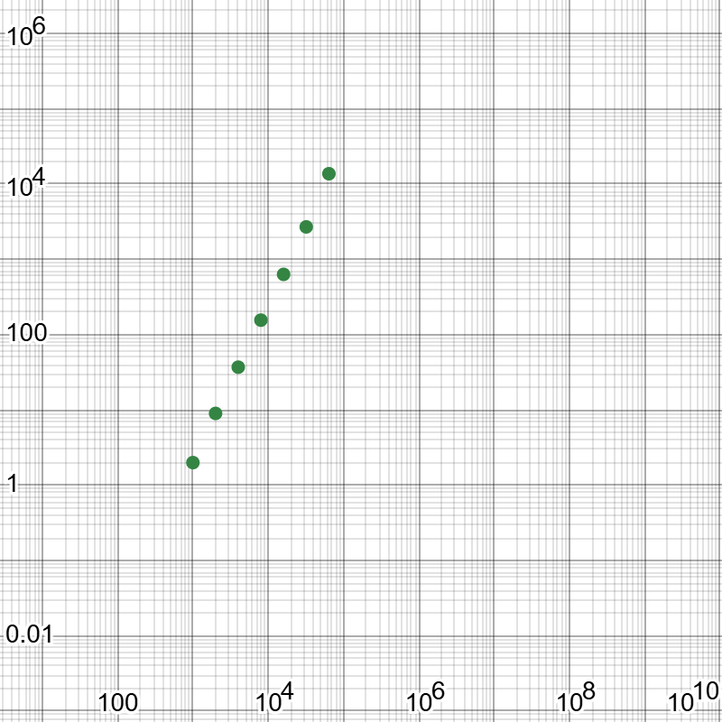
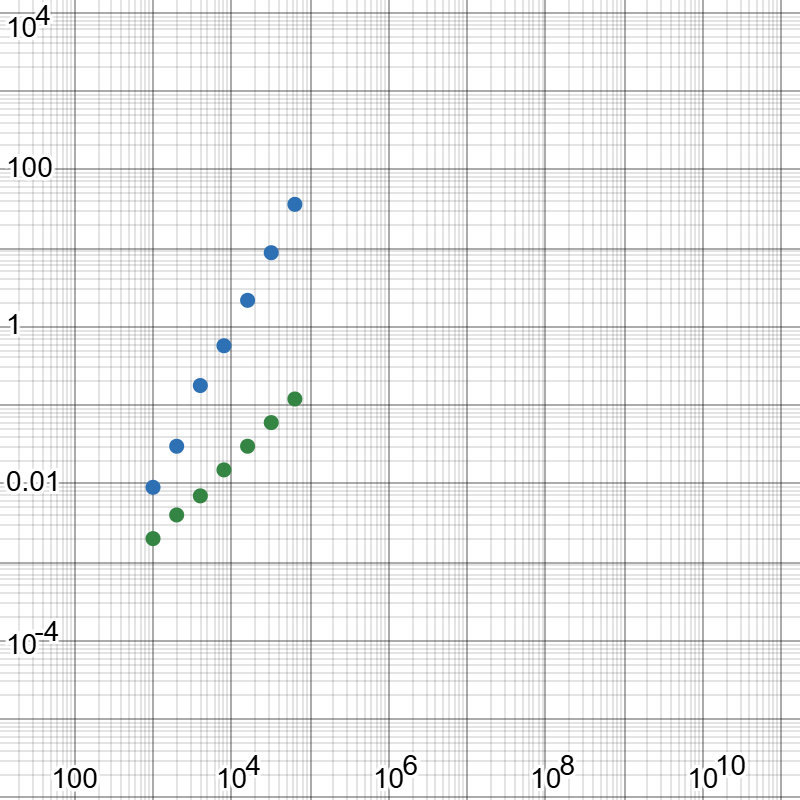

Machine: Windows 4Ghz CPU 32GB RAM, SSD
Language: Python
Version : 3.13.1

Pre-guess: comparisons = 2(n*m)

Note: All experiments performed with match_rate = 0.5

| n | m | comparisons | wall time (s) | output_tuples |
|---:|---:|---:|---:|---:|
| 1000 | 1000 | 2,000,000 | 2 | 500 |
| 2000 | 2000 | 8,000,000 | 9 | 1,000 |
| 4000 | 4000 | 32,000,000 | 37 | 2,000 |
| 8000 | 8000 | 128,000,000 | 156 | 4,000 |
| 16000 | 16000 | 512,000,000 | 632 | 8,000 |
| 32000 | 32000 | 2,048,000,000 | 2,597 | 16,000 |
| 64000 | 64000 | 8,192,000,000 | 13,725 | 32,000 |

Questions:
Q1. What is the exact relationship between n, m and your comparison count? Does the measured count match the formula exactly? If it does not, explain the discrepancy.

A1. Comparison count is exactly 2nm. It matches the formula exactly. Join performs times(n, m) which is exactly nm comparisons and gives a result of size nm. Select performs nm comparisons on the result of size nm, meaning there are nm + nm or 2nm comparisons total

Q2. Plot time against n on log-log axes. What is the slope, and what does that slope tell you about the algorithm?

A2. 

The relationship is between n and t is roughly linear on log-log axes with a slope of about 2. This indicates the execution times grows roughly quadratically with respect to n or O(n^2). This makes sense given the comparison count scales quadratically with n as well, meaning comparison count and time are related and grow at similar rates with respect to n. The only slight outlier is n=64,000, which is higher than expected based ont he pattern from the other. This is lkely due to hardware issues beginning to affect the wall time as opposed to the base functionality sudenly breaking pattern

Q3. Measure select and project at the same sizes. How do those curves differ from the join, and why? 

A3. 

| n | select wall time (s) | project wall time (s) |
|---:|---:|---:|
| 1000 | 0.002 | 0.009 |
| 2000 | 0.004 | 0.030 |
| 4000 | 0.007 | 0.178 |
| 8000 | 0.015 | 0.572 |
| 16000 | 0.030 | 2.165 |
| 32000 | 0.060 | 8.747 |
| 64000 | 0.120 | 36.140 |

The relation between n and t in roughly linear on log-log axes for both select and project, but they have different slopes. The slope of select point has a slope of roughly one, implying an actual linear relationship. This makes sense, as we can see the select time roughly double for each times n doubles, which is in line with the idea the select performs 1 comparison per n. Project has a slope of roughly 2, implying a quadratic relationship. This makes sense, as the project operation has 2 steps, one of which is O(n^2). First, it goes through each tuple and creates a new one with only the matching columns which is O(n), however it then has to go through and remove duplicates, checking all other new tuples for each new tuple in order to ensure there are no duplicates, which is O(n^2), cause this expected quadratic relationship

Q4. Using your measurements, predict how long the join would take with one million tuples on each side. Show the arithmetic. Do not run it.

A4. 

By averaging time / comparisons / 1,000,000 for n 2,000 -> 32,000, we can find that the ratio of time to million comparisons is roughly 1.2. Ignoring 1000 as size is too small to be helpful and 64000 as hardware limitations shouldn't affect the general formula

n = 1,000,000

m = 1,000,000

comparisons = 2nm = 2 * 1,000,000 * 1,000,000 = 2,000,000,000,000

t ≈ comparisons / 1,000,000 * 1.2 ≈ 2,000,000,000,000 / 1,000,000 * 1.2 ≈ 2,400,000 seconds

So, an n = m = 1,000,000 tuple join would take roughly 2,400,000 seconds or 27.7777 days before hardware constraints which would almost definitely affect the time further

Q5. Does changing the match rate change the comparison count? Does it change the wall time? Explain why those two answers differ.

A5. Changing match rate does not change comparison count. Times is unaffected in comparisons and time by match rate as it does not care about values, just amount of tuples per relation. Select is unaffected in comparisons by match rate as it always does one comparison per tuple regardless of result. Select is technically affected in time by match rate, as a higher match rate means more tuples have to be appended and stored to result rather than skipped, although this difference is almost nothing in comparison to the time due to comparisons.

Q6. In one paragraph, describe what you would have to change to make the million-tuple join feasible. You do not have to implement it.

A6. The main change necessary to make million-tuple join feasible in altering the functionality so that comparisons < O(n^2). Currently, comparisons scale quadratically with n, making joins infeasible for large n. One idea for how to implement this could be some sort of hash, where tuples are placed intoa has table based on join attribute, allowing matching tuples to be found without comparing every pair to every pair, ideally reducing complexity to O(n + m) making it much more feasible for million tuple joins